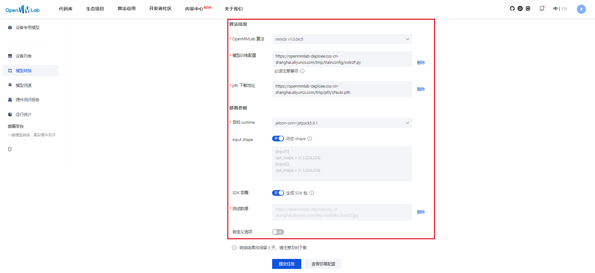
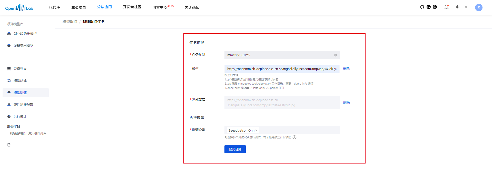

# 分类模型微调以及在Jetson平台上进行测速

# 1 项目介绍
本项目使用mmpretrain对预训练的分类模型在垃圾分类数据集上进行微调，同时对微调后模型进行测试、部署、测速。

本项目在Geforce RTX2060进行训练微调，所使用模型为[efficientnet-b1](mmpretrain/configs/efficientnet/README.md)，
同时我们选择官方所提供的预训练模型作为base模型在其基础上进行微调。
- [任务详情](https://github.com/open-mmlab/OpenMMLabCamp/discussions/566)
- base模型[Config](https://github.com/open-mmlab/mmpretrain/blob/mmcls-1.x/configs/efficientnet/efficientnet-b2_8xb32_in1k.py)和[权重](https://download.openmmlab.com/mmclassification/v0/efficientnet/efficientnet-b1_3rdparty-ra-noisystudent_in1k_20221103-756bcbc0.pth)
- 微调使用的模型[Config](./mmpretrain/configs/efficientnet/efficientnet-b1_ingarbage.py)

# 2 训练/测试环境
本次项目基于以下环境进行训练/测试：

- mmcv>=2.0.1
- mmcls>=1.0.0rc6
- mmengine>=0.8.3
- mmdeploy>=1.0.0
- cuda>=10.2
- pytorch>=1.10.1


# 3 数据集和数据集注册

本项目选择的数据集为[garbage数据集](https://aistudio.baidu.com/aistudio/datasetdetail/77996)


由于该次微调所使用的数据集并非官方数据集，因此我们需要对数据集进行注册。

## 注册流程如下：
- 1.将garbage.py移入mmpretrain/mmpretrain/datasets文件夹下

- 2.打开mmpretrain/mmpretrain/datasets/__init__.py文件

- 3.导入Garbage类，同时在__all__中添加Garbage即可完成注册


官方教学文档：[点击](https://mmpretrain.readthedocs.io/zh_CN/latest/advanced_guides/datasets.html)

# 4 模型训练与功能测试

## 4.1 模型训练

本次训练所使用配置文件：[点击](./data/efficientnet-b1_1xb16_ingarbage.py)
微调参数如下：

| 参数名        |       |
|------------|-------|
| max_epochs | 10    |
| batch_size | 16    |
| lr         | 0.01  |
| milestones | 2,5,8 |


训练命令为：

```
python tools/train.py ./configs/efficientnet/efficientnet-b1_1xb16_ingarbage.py
```

## 4.2 功能测试

功能测试命令为：

```
python tools/test.py ./work_dir/garbage/efficientnet-b1_1xb16_ingarbage.py ./work_dir/garbage/epoch_9.pth
```

微调后的模型功能测试结果为：

```
accuracy/top1: 88.9800  data_time: 0.0337  time: 0.0813
```

- 本次训练日志：[点击](data/log/20230801_110349/20230801_110349.log)
- 训练后的模型本次功能测试结果：[点击](data/log/20230801_124732/20230801_124732.json)

# 5 模型部署

## 5.1 模型转换

1. 进入[模型转换页面](https://platform.openmmlab.com/deploee/task-convert-list)， 点击"模型转换"，点击“新建转换任务”。

2. 输入内容如下图所示：
"OpenMMLab 算法"：选择"mmcls v1.0.0rc5"。

    "模型训练配置"：上传 模型work_dir下训练所使用的配置文件。

    "pth 下载地址"： 上传 训练所得的模型权重。

    "目标 runtime"：选择"jetson-orin+jetpack5.0.1"。

    "input shape"：开。

    "SDK 部署"： 开。

    "测试数据"：从数据集中选择一张图片上传。

    "自定义选项"：关。

3. 点击"提交任务"，等待转换完成。

4. 转换完成后，点击"下载模型"，下载zip文件。

## 5.2 模型测速

1. 进入[模型测速页面](https://platform.openmmlab.com/deploee/task-profile-list)， 点击"模型测速"，点击“新建测速任务”。

2. 输入内容如下图所示："任务类型"：选择"mmcls v1.0.0rc5"。

    "模型"：上传上一步下载的zip文件。

    "测试数据"：从数据集中选择一张图片上传。

    "测速设备"：选择"<span class="ant-select-selection-item-content">Seeed Jetson Orin</span>"。

3. 点击"提交任务"，等待速度测试完成。

4. 速度测试完成后，点击"查看测速报告"。

部分测试结果
```
========== cmd ==========
LD_LIBRARY_PATH=/tmp/aarch64-jetson-orin+jetpack5.0.1/install/lib:/tmp/aarch64-jetson-orin+jetpack5.0.1/install/ocv/lib:${LD_LIBRARY_PATH} /tmp/aarch64-jetson-orin+jetpack5.0.1/install/bin/classifier --device cuda /tmp/datadir /tmp/datadir/tv4mdW.jpg
========== stdout ==========
[2023-08-01 14:53:53.392] [mmdeploy] [info] [model.cpp:35] [DirectoryModel] Load model: "/tmp/datadir"
label: 0, label_id: 41, score: 0.9577
label: 1, label_id: 127, score: 0.0296
label: 2, label_id: 65, score: 0.0025
label: 3, label_id: 156, score: 0.0023
label: 4, label_id: 25, score: 0.0006
========== stderr ==========
None
========== analyze ==========
+---------------------------+--------+-------+--------+----------+----------+----------+
|           name            | occupy | usage | n_call |  t_mean  |  t_50%   |  t_90%   |
+===========================+========+=======+========+==========+==========+==========+
| ./Pipeline                | -      | -     | 1      | 1014.730 | 1014.730 | 1014.730 |
+---------------------------+--------+-------+--------+----------+----------+----------+
|     Preprocess/Compose    | -      | -     | 1      | 2.141    | 2.141    | 2.141    |
+---------------------------+--------+-------+--------+----------+----------+----------+
|         LoadImageFromFile | 0.002  | 0.002 | 1      | 1.588    | 1.588    | 1.588    |
+---------------------------+--------+-------+--------+----------+----------+----------+
|         CenterCrop        | 0.000  | 0.000 | 1      | 0.209    | 0.209    | 0.209    |
+---------------------------+--------+-------+--------+----------+----------+----------+
|         Normalize         | 0.000  | 0.000 | 1      | 0.177    | 0.177    | 0.177    |
+---------------------------+--------+-------+--------+----------+----------+----------+
|         ImageToTensor     | 0.000  | 0.000 | 1      | 0.140    | 0.140    | 0.140    |
+---------------------------+--------+-------+--------+----------+----------+----------+
|         Collect           | 0.000  | 0.000 | 1      | 0.016    | 0.016    | 0.016    |
+---------------------------+--------+-------+--------+----------+----------+----------+
|     efficientnet          | 0.998  | 0.998 | 1      | 1012.415 | 1012.415 | 1012.415 |
+---------------------------+--------+-------+--------+----------+----------+----------+
|     postprocess           | 0.000  | 0.000 | 1      | 0.107    | 0.107    | 0.107    |
+---------------------------+--------+-------+--------+----------+----------+----------+
```
本次测速报告详情：[点击](https://openmmlab-deploee.oss-cn-shanghai.aliyuncs.com/tmp/profile_speed/3b7310.txt)

# 6 问题以及解决方案
1. 问题：[模型转换页面](https://platform.openmmlab.com/deploee/task-convert-list)无法使用基于mmpretrain进行微调的模型
```
解决方案：需要基于mmcls>=1.0.0rc5进行训练，因此需要切换到mmcls-1.x分支下再进行训练
```

2. 问题：在进行[模型测速](https://platform.openmmlab.com/deploee/task-profile-list)时，由于老版本的mmdeploy没有不支持EfficientnetCenterCrop预处理，在测速时会进行报错
```
解决方案：在配置文件中需要将EfficientnetCenterCrop和EfficientnetRandomCrop修改为老版本支持的CenterCrop和RandomResizedCrop
注：修改完之后重新训练相较于之前会损失一定的精度
```

# 7 致谢
感谢[OpenMMLab](https://github.com/open-mmlab)以及[Seeed](https://wiki.seeedstudio.com/Getting_Started)的各位老师指导，感谢[炯炯同学](https://github.com/jiongjiongli/mmdet_jetson)的交流讨论！